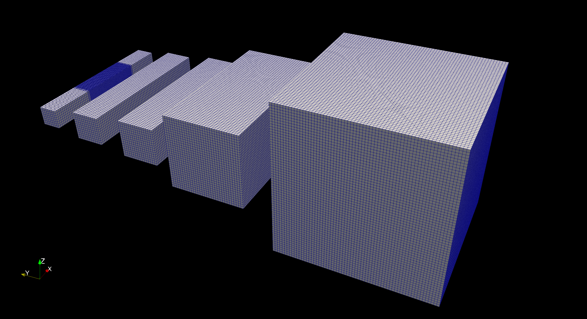
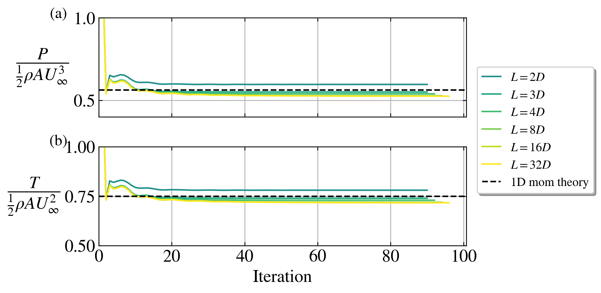
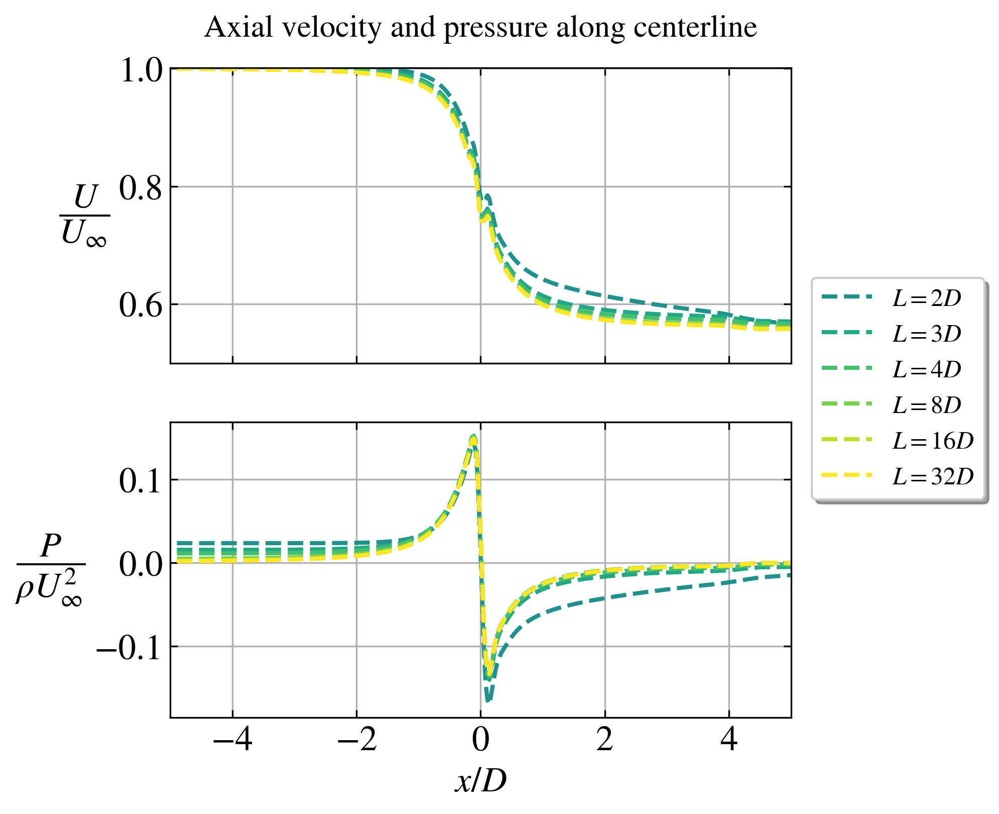
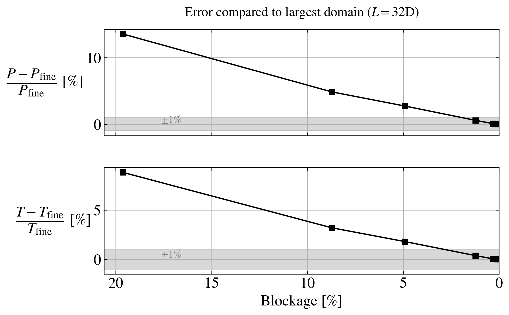

# Blockage study

Single AD with 3D Euler equations. Uniform and laminar inflow.

Investigation of blockage effect. The blockage ratio is defined as

$$
B = \frac{\pi R^2}{L_y L_z}
$$

## Parameters

- Rotor diameter: $D = 80$ m.
- Thrust coefficient based on disk velocity: $C_T' = \frac{4}{3}$ (corresponds to $C_T = 0.75$ via 1D mom theory)
- Disk center location: At (0,0,0)
- Streamwise domain length: $L_x/D = 16$.
- Cross-stream domain length: $L_y/D = L_z/D = \{2,3,4,8,16,32\}$.
- Blockage ratio: $B = \{19.6,8.7,4.9,1.2,0.3,0.1\}$ %.
- Cell size in background grid: $\frac{D}{\Delta x} = 4$.
- Refinement region: $x/D = [-3,4]$, $y/D = [-1,1]$, $z/D = [-1,1]$.
- Cell size in refinement region: $\frac{D}{\Delta x} = 16$

All simulations are relatively quick to simulate (less than a minute on 8 cores).

## Domain

## Results 

Comments:

- The blockage effect is approximately linear with the blockage ratio.
- It is necessary to have a small blockage ratio ($B < 2$ %) to be within +/- 1% of the infinite domain ($B = 0$ %) case. 
