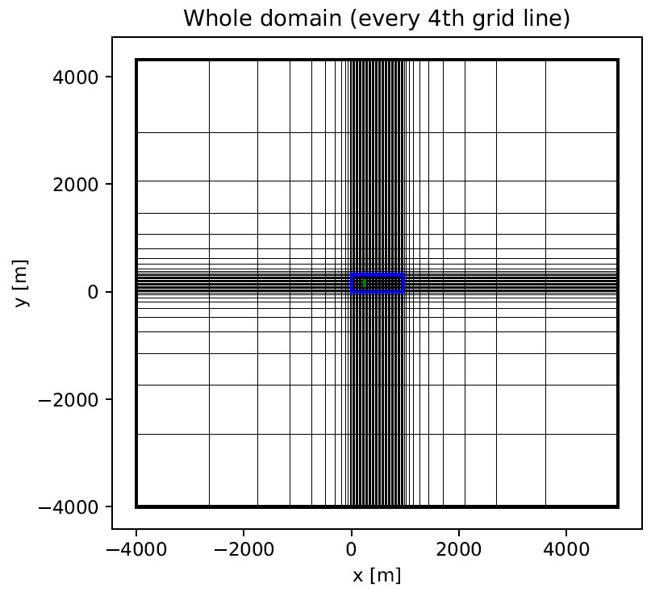
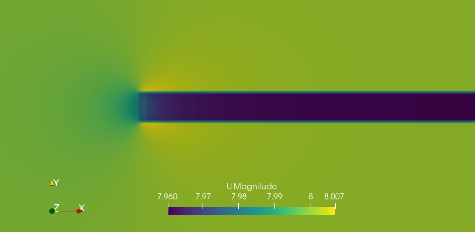
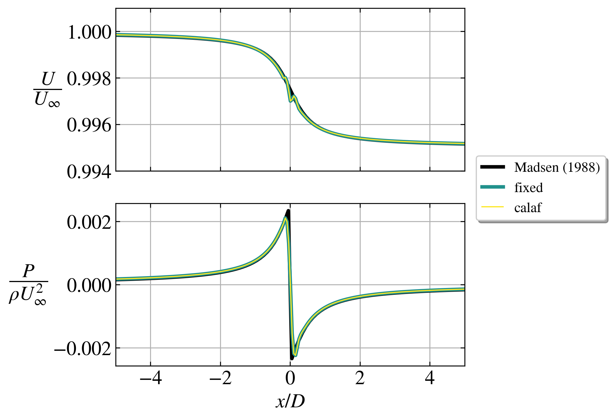
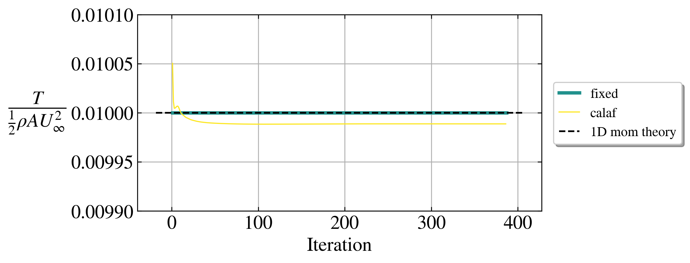

# euler2d

The AD model can also be used in 2D. More info in (Baungaard, Nishino & van der Laan, 2025).

There are two cases in this folder, "fixed" and "calaf" (the two AD variants). Each case only takes around 5 seconds to run on my laptop.

## Grid

- Rotor diameter: $D = 80$ m.
- Resolution (in wake domain): $\frac{D}{\Delta x} = \frac{D}{\Delta y} = 16$.
- Wake domain size: $l_x/D = 12$, $l_y/D = 4$.
- Domain size: $L_x/D = 112$, $L_y/D = 104$.
- Total number of cells: 42k.

A rather large domain size is used to avoid artificial tunnel blockage, which was found to be important to get a good match with the analytical solution. To avoid an excessive amount of cells, grid streching is used. The grid has been generated with the [farm2d](https://github.com/mchba/farm2d) code.

## Flow field

To run a case, go to one of folders and `./Allrun`. The flow can be visualized with [Paraview](https://www.paraview.org/) by loading the `test.foam` file. Here is the flowfield from the calaf case:

## Verification with analytical model

An analytical solution exists for the 2D Euler equations with a single AD, if $C_T \ll 1$, which was derived by Madsen (1988). A thrust cofficient of $C_T = 0.01$ is used in this case. See more details in Appendix B of Baungaard, Nishino & van der Laan (2025).

