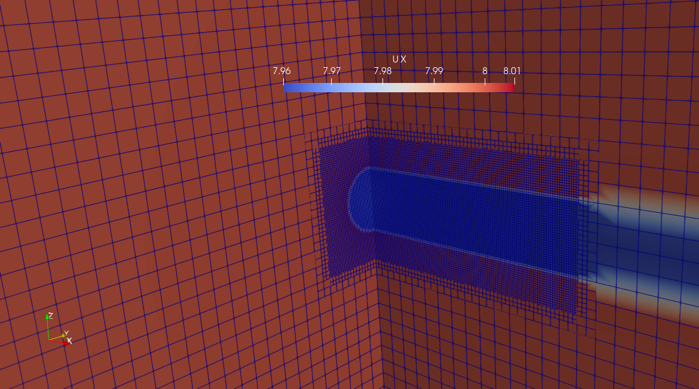

# euler3d

Single AD with 3D Euler equations. Uniform and laminar inflow.

## Grid

Two grids, coarse and fine, are included. Both have:

- Rotor diameter: $D = 80$ m.
- Domain size: $L_x/D = L_y/D = L_z/D = 16$.

### Coarse grid

- Uniform resolution of: $\frac{D}{\Delta x} = \frac{D}{\Delta y} =\frac{D}{\Delta z} = 4$.
- Total number of cells: 262k.

### Fine grid

SnappyHexMesh is used to refine the coarse grid in a boxed region around the turbine. Three refinement levels are used, hence the resolution is $D/32$ in this region.

- Total number of cells: 1.2M.

## Verification with analytical model

An analytical solution exists for the 3D Euler equations with a single AD, if $C_T \ll 1$, which was derived by Koning (1935), see also Réthoré & Sørensen (2012). A thrust cofficient of $C_T = 0.01$ is used in this case.

Approximate runtimes on my laptop:
- Coarse: 6 s (on 4 cores)
- Fine: 71 s (on 4 cores)

