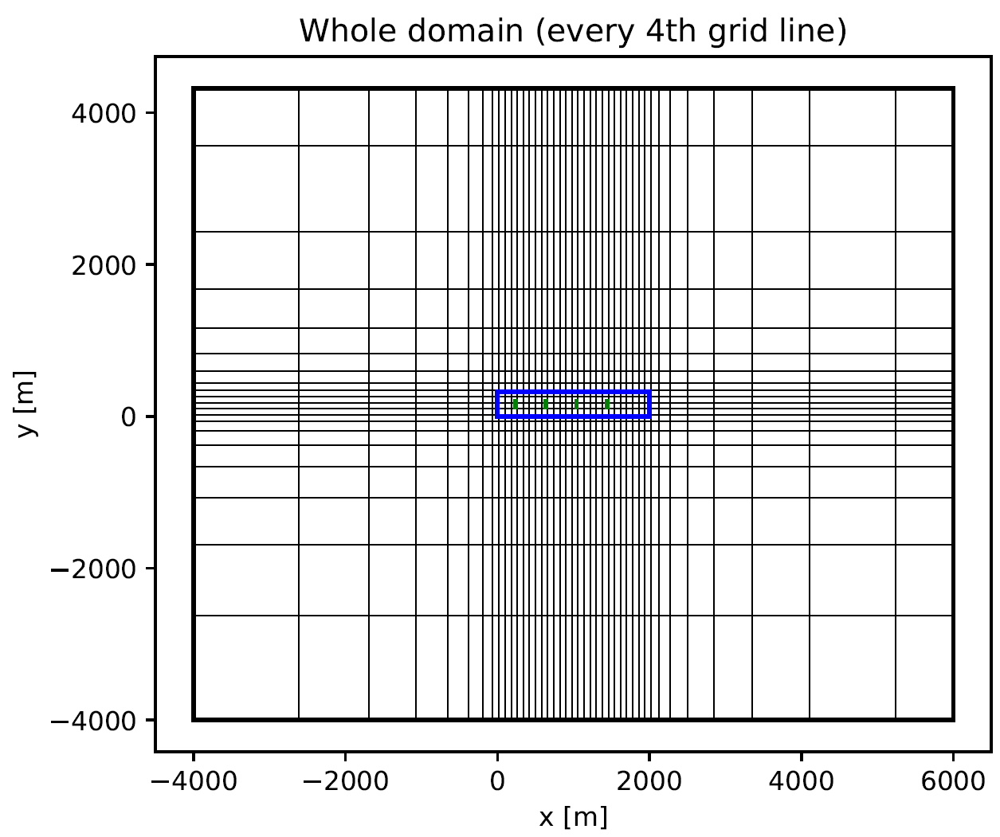
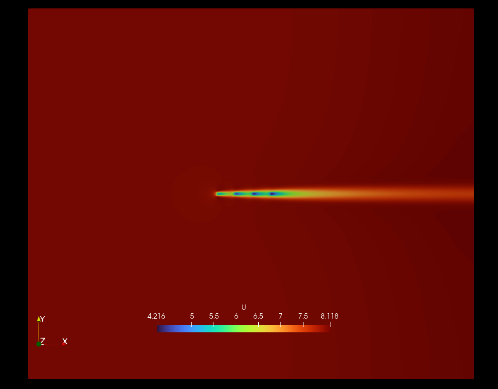

# four_turbines

A case with four ADs. Atmospheric surface layer (aka. log-law) inflow.

Takes around 1.5 minute to simulate on my laptop. Coarse resolution and loose residual criterias are used.

## Grid

A uniform grid is used in center region of the grid (the "wake domain"). Geometric streching is applied in the outer parts of the domain.

- Rotor diameter: $D = 80$ m.
- Resolution (wake domain): $\frac{D}{\Delta x} = \frac{D}{\Delta y} = 4$.
- Wake domain size: $l_x/D = 25$, $l_y/D = 4$.
- Domain size: $L_x/D = 125$, $L_y/D = 104$ and $L_z/D = 25$
- Total number of cells: 581k.

## Inflow

Neutral atmospheric surface layer (see [single_turbine example](https://github.com/mchba/actuatorDiskFoam/tree/main/examples/single_turbine#inflow)) with

- $U(z_h) = 8$ m/s
- $I(z_h) = 5.4$ %.

## Flow field

Visualized with Paraview

## Recommended settings
The grid resolution and residual criteria were set low in this example, so that the case runs fast. For real simulations, it is recommended to increase the resolution to $D/\Delta x = 8$ and to use a residual criterium of 1e-3.

Also, be aware that if you change the velocity, turbulence intensity, or vertical domain size, then all the parameters in `ASLparameters` need to be changed accordingly to satisfy the log-law. If you change the resolution, also remember to adjust the AD thickness in `topoSetDict` (it is recommended that the thickness is $2 \Delta x$).

