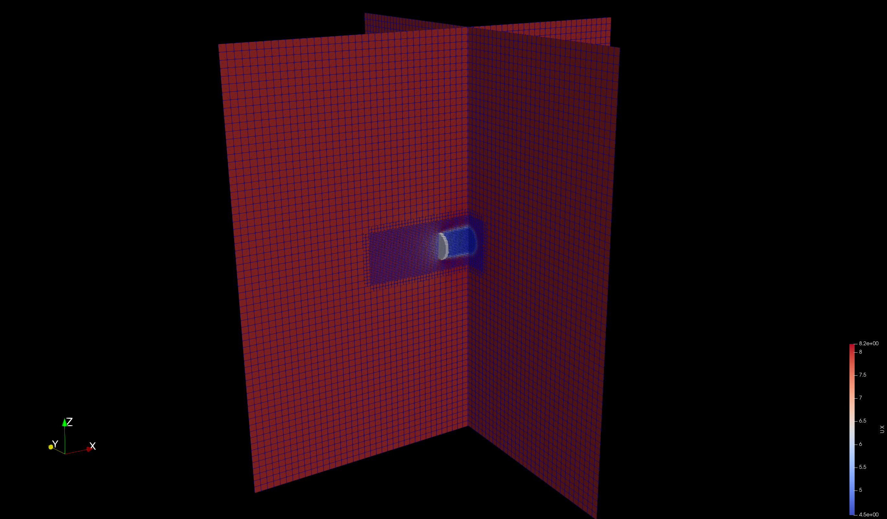
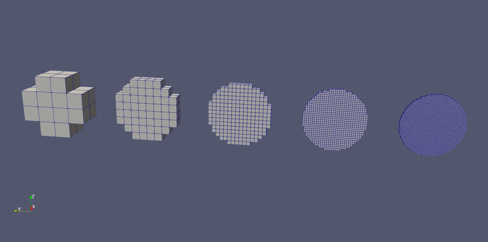
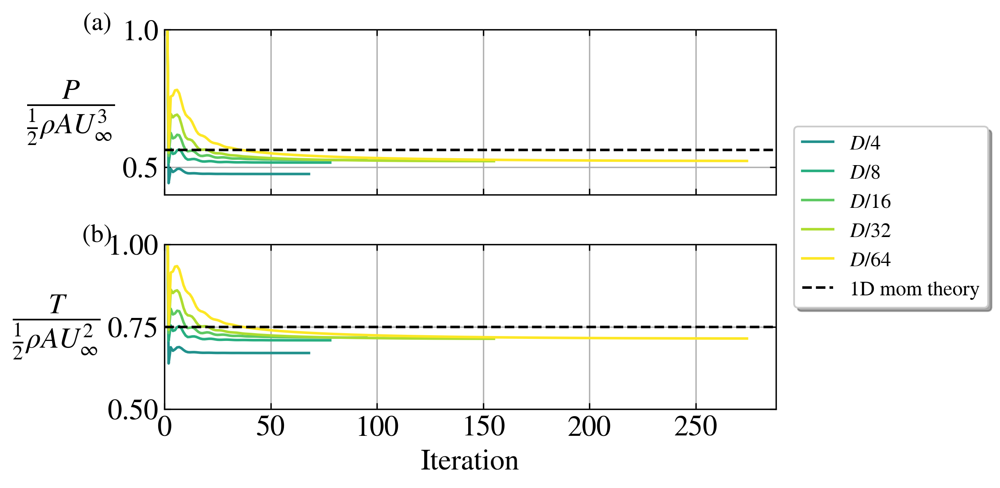
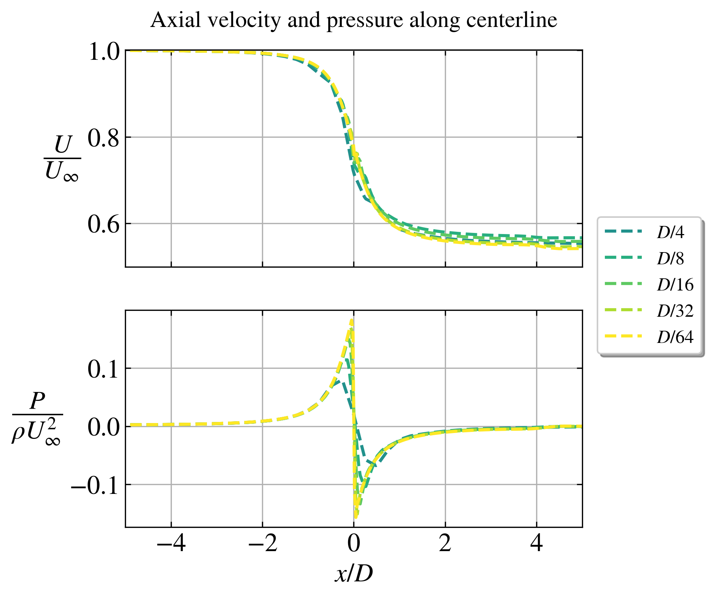
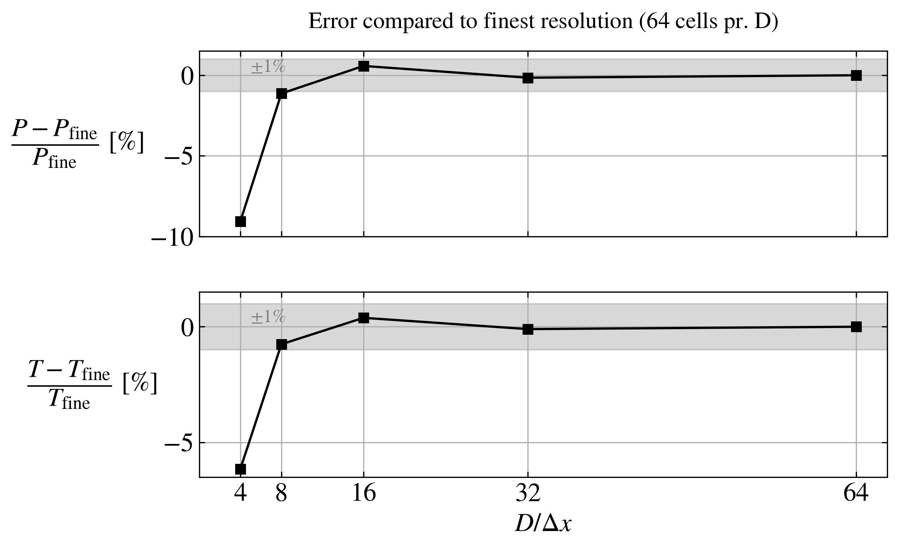

# Grid study

Single AD with 3D Euler equations. Uniform and laminar inflow.

Study of the grid resolution.

## Parameters

- Rotor diameter: $D = 80$ m.
- Thrust coefficient based on disk velocity: $C_T' = \frac{4}{3}$ (corresponds to $C_T = 0.75$ via 1D mom theory)
- Disk center location: At (0,0,0)
- Domain size: $L_x/D = L_y/D = L_z/D = 16$.
- Blockage ratio: $\pi R^2/(L_y L_z) = 0.3$ %.
- Cell size in background grid: $\frac{D}{\Delta x} = 4$.
- Refinement region: $x/D = [-3,4]$, $y/D = [-1,1]$, $z/D = [-1,1]$.
- Cell size in refinement region: $\frac{D}{\Delta x} = \{4,8,16,32,64\}$

Number of cells in the finest simulation is 7.8M and that simulation takes 263s to simulate on 8 cores.

## Grid

The simulation with $\frac{D}{\Delta x} = 16$ resolution in the refined region.

## AD

With `actuatorDiskFoam` the resolution of the AD follows the resolution of the background grid. The AD is chosen to have a thickness of two cells (better numerical stability than just one cell), hence the AD thickness decreases for increasing resolution.

## Results 

Comments:

- There is less than 1% underprediction of thrust and power at only 8 cells pr. diameter compared to the finest resolved case.
- The convergence is not monotonic. I suspect it could be due to that a snappyHex refinement box is used rather than refining the whole domain.
- The refinement box ends at 4D downstream, which explain the small drop in velocity there.
