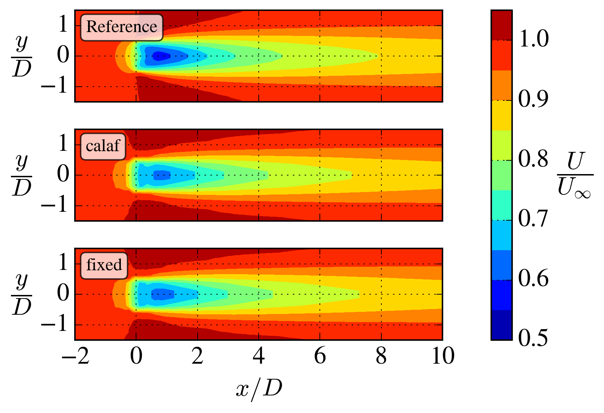

# single_turbine

A single AD case with atmospheric surface layer (aka. log-law) inflow.

Each case takes around 25 seconds to simulate on my laptop. This is possible because of the coarse resolution and small domain size, which however reduces the accuracy of the simulations.

## Grid

A uniform grid is used in the horizontal directions. Geometric streching is applied in the vertical direction to better resolve the velocity gradient near the ground.

- Rotor diameter: $D = 80$ m.
- Resolution: $\frac{D}{\Delta x} = \frac{D}{\Delta y} = 4$.
- Domain size: $L_x/D = 32$, $L_y/D = 16$.
- Total number of cells: 262k.

## Inflow

The atmospheric surface layer is described by

$$
U(z) = \frac{u_*}{\kappa} \textrm{ln}\left(\frac{z}{z_0} \right)
$$

$$
k(z) = \frac{u_*^2}{\sqrt{C_\mu}}
$$

$$
\varepsilon(z) = \frac{u_*^3}{\kappa z}
$$

which are set at the inlet and top of the domain.

In this example, we set $u_*$ and $z_0$ to obtain $U(z_h) = 8$ m/s and $I(z_h) = 5.4$ % (where $I \equiv \sqrt{\frac{2}{3}k}/U$).

## Comparison with reference data

We here compare with data from [Baungaard et al. (2022)](https://wes.copernicus.org/articles/7/1975/2022/), who simulated the same case. For demonstrating purposes, a coarse resolution and small domain is used in this example.

Reasons for disagreement:
- The grid resolution ($\Delta x = D/4$) used here is too coarse. It was shown in Appendix A of [(Baungaard, Nishino and van der Laan, 2025)](https://wes.copernicus.org/preprints/wes-2025-50/), that it is necessary to use a resolution of at least $D/\Delta x = 8$ to get a grid-converged simulation.
- The domain is too small. Usually, one employs grid streching in the horizontal directions to avoid tunnel blockage effects and any interference from the boundaries.
- The reference was simulated with the EllipSys3D code, which has certain numerical differences compared to OpenFOAM.

With an increased grid resolution and a larger domain, one will get an excellent agreement with the reference data, see Fig. 3a and 3b in [(Baungaard, Nishino and van der Laan, 2025)](https://wes.copernicus.org/preprints/wes-2025-50/).

