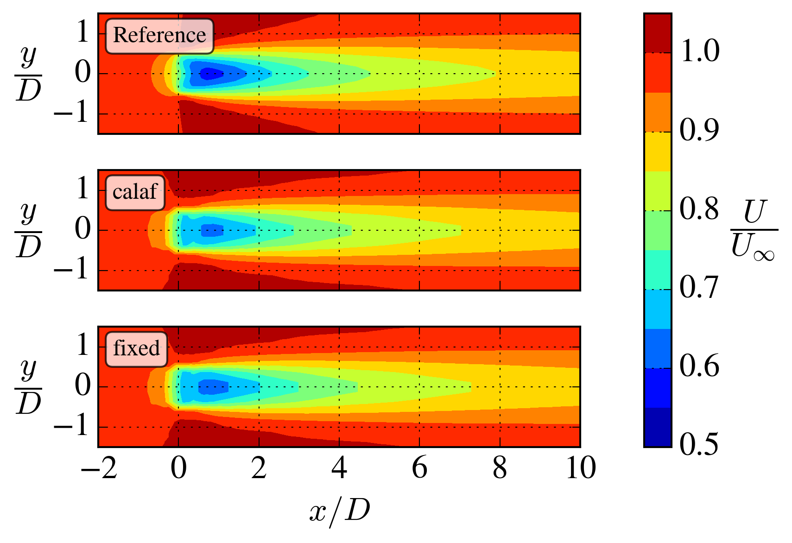

# single_turbine

A single AD case with atmospheric surface layer (aka. log-law) inflow.

Each case takes around 25 seconds to simulate on my laptop. This is possible because of the coarse resolution and small domain size, which however reduces the accuracy of the simulations.

## Grid

A uniform grid is used in the horizontal directions. Geometric streching is applied in the vertical direction to better resolve the velocity gradient near the ground.

- Rotor diameter: $D = 80$ m.
- Resolution: $\frac{D}{\Delta x} = \frac{D}{\Delta y} = 4$.
- Domain size: $L_x/D = 32$, $L_y/D = 16$.
- Total number of cells: 262k.

## Inflow

The atmospheric surface layer is described by

$$
U(z) = \frac{u_*}{\kappa} \textrm{ln}\left(\frac{z}{z_0} \right)
$$

$$
k(z) = \frac{u_*^2}{\sqrt{C_\mu}}
$$

$$
\varepsilon(z) = \frac{u_*^3}{\kappa z}
$$

which are set at the inlet and top of the domain.

In this example, we set $u_*$ and $z_0$ to obtain $U(z_h) = 8$ m/s and $I(z_h) = 5.4$ % (where $I \equiv \sqrt{\frac{2}{3}k}/U$).

## Comparison with reference data

We here compare with data from [Baungaard et al. (2022)](https://wes.copernicus.org/articles/7/1975/2022/), who simulated the same case. For demonstrating purposes, a coarse resolution and small domain is used in this example.

Reasons for disagreement:
- The grid resolution ($\Delta x = D/4$) used here is too coarse. It was shown in Appendix A of [(Baungaard, Nishino and van der Laan, 2025)](https://wes.copernicus.org/preprints/wes-2025-50/), that it is necessary to use a resolution of at least $D/\Delta x = 8$ to get a grid-converged simulation.
- The domain is too small. Usually, one employs grid streching in the horizontal directions to avoid tunnel blockage effects and any interference from the boundaries.
- The reference was simulated with the EllipSys3D code, which has certain numerical differences compared to OpenFOAM.

With an increased grid resolution and a larger domain, one will get an excellent agreement with the reference data, see Fig. 3a and 3b in [(Baungaard, Nishino and van der Laan, 2025)](https://wes.copernicus.org/preprints/wes-2025-50/).

## Crucial Naming convention
fixed -is still for the case where the thrust is preset by the user and applied uniformly over the set cylindrical area

calaf -  Ct based on the disk velocity

constgauss - the same as fixed but the force is smeared over the topolgy with a super Gaussian kernel

## Using Gauss
This smears the force in the axial and radial direction. This is to avoid any numerically wiggles BUT is not the same as using a raidally variable forcing (the force "still can be viewed" as constnat across the grid). It Requires the setting of a disk radius and diameter for the smearing which is super Gaussian and based on the work by Jané‐Ippel et al. - 2024
(https://onlinelibrary.wiley.com/doi/10.1002/we.2946)

For the above kernel the original work calibrated the alphas already to 2 and 8 respectivly based on experimental data of Chamorro et al. , see also King et al. The user input is therefore just disk thickness and radius.
We also print out the actual total thrust applied and the throretical thrust so you can be condfident that this is still conserved.

Chamorro - https://link.springer.com/article/10.1007/s10546-010-9512-1

King - https://wes.copernicus.org/articles/2/115/2017/

Finally be aware that in toposet for Gauss smearing the cylinder volume is now just he general volume that the force will be smeared over so should be grater than the width and radius of the disk itself. This because the kernell itslef will go to zero with distance from the disk

