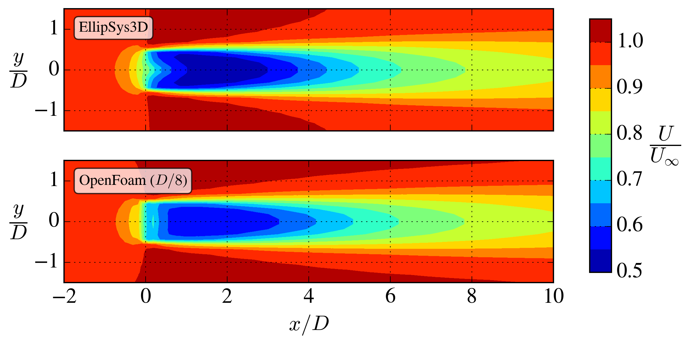
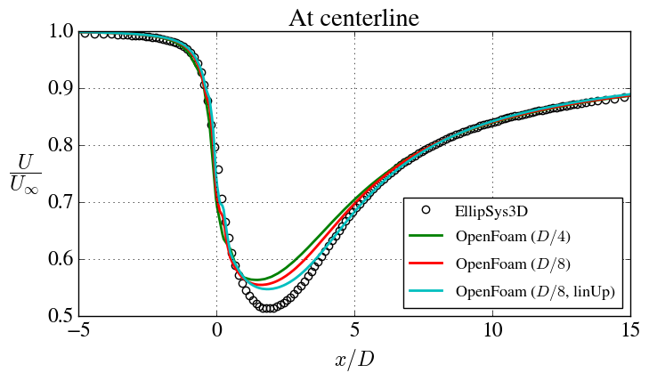
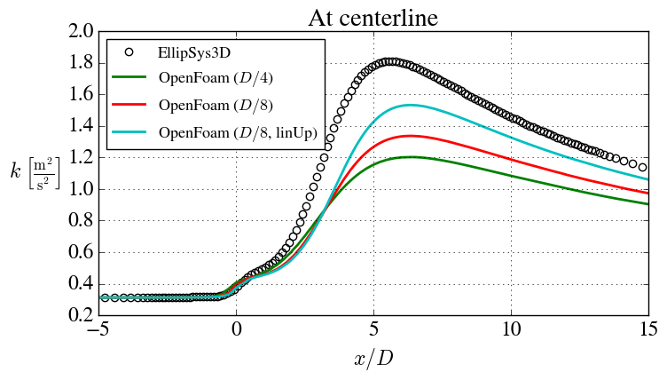

# single_turbine with $k$-$`\varepsilon`$-$`f_p`$

A single AD case with atmospheric surface layer (aka. log-law) inflow using the $k$-$\varepsilon$-$f_p$ turbulence model [(van der Laan et al., 2015)](https://onlinelibrary.wiley.com/doi/abs/10.1002/we.1736).

The 4cD and 8cD simulations took around 2s and 25s, respectively, to simulate on my laptop (Apple M4 pro).

## Compiling the kEpsilonFp code

*G. P. Navarro Dias implemented a [version](https://www.researchgate.net/publication/340929542_code_available_k-epsilon-fp_turbulence_model_for_OpenFOAM_41_and_OpenFOAM_v2012_From_van_dar_Laan_et_al_2015) of the $k$-$\varepsilon$-$f_p$ model. The current version is similar, but with a few updates*. 


The $k$-$\varepsilon$-$f_p$ model is not included in the default OpenFoam installation, so you need to compile this first. 

0. If you don't already have it, create a user directory, [see here](https://github.com/mchba/actuatorDiskFoam/tree/main?tab=readme-ov-file#actuator-disk-ad-compilation).

1. Create the below folder tree in your `$WM_PROJECT_USER_DIR/src`-folder. You can just copy it from the `kefp_src`-folder.


```bash 
src/
└── TurbulenceModels
    ├── incompressible
    │   ├── Make
    │   │   ├── files
    │   │   └── options
    │   └── turbulentTransportModels
    │       └── myTurbulentTransportModels.C
    └── turbulenceModels
        └── RAS
            └── kEpsilonFp
                ├── kEpsilonFp.C
                └── kEpsilonFp.H
```

2. `cd TurbulenceModels`
3. `wmakeLnInclude -u turbulenceModels`. This creates a `lnInclude`-folder in the `turbulenceModels`-folder. If you add other turbulence models in the future, this step should be repeated.
4. `cd incompressible`
5. `wmake`. This creates a `lnInclude`-folder in the current folder and a `libmyIncompressibleTurbulenceModels.dylib`-executable (.dylib for Mac or .so for Linux) in your `$WM_PROJECT_USER_DIR/platforms/*`-folder.  

Now you should be able to use the $k$-$\varepsilon$-$f_p$ model in your OpenFoam simulations.

See also the [guide](https://onlinelibrary.wiley.com/doi/abs/10.1002/we.1736)  by Håkan Nilsson (especially the section "Implement your own versions of kEpsilon and kOmegaSST").


## Grid

A uniform grid is used in the center of the domain with stretching outwards from there. Streching is also applied in the vertical direction to better resolve the velocity gradient near the ground.

- Rotor diameter: $D = 80$ m.
- Domain size: $L_x/D = 24$, $L_y/D = 16$, $L_z/D = 8$.
- Resolution: Two grids are used, $\frac{D}{4}$ and $\frac{D}{8}$, respectively.
- Total number of cells: 82k and 337k.


## Inflow

Log-law (see single_turbine [readme](https://github.com/mchba/actuatorDiskFoam/tree/main/examples/single_turbine)).


## Comparison with reference data

We here compare with data from [Baungaard et al. (2022)](https://wes.copernicus.org/articles/7/1975/2022/), who simulated the same case.






Possible reasons for disagreement with EllipSys3D:
- Different implementations of the AD. The one in EllipSys can refine the AD independently of the background grid, hence the grid requirement is likely less.
- Different numerical schemes. EllipSys uses QUICK, while upwind and linearUpwind were tried in OpenFoam. Unfortunately, the QUICK scheme in OpenFoam does not work well for this case.
- The grids in the two codes are not the exactly the same (the EllipSys domain was larger and use another vertical stretching).

In summary: The current case is more difficult for OpenFoam (compared to the [case](https://github.com/mchba/actuatorDiskFoam/tree/main/examples/single_turbine) with the standard $k$-$\varepsilon$ model), probably because of the larger velocity gradients in the wake. It is nevertheless recommended to use the current setup, because the $k$-$\varepsilon$-$f_p$ model is more accurate than the standard $k$-$\varepsilon$ model [(van der Laan et al., 2015)](https://onlinelibrary.wiley.com/doi/abs/10.1002/we.1736).


