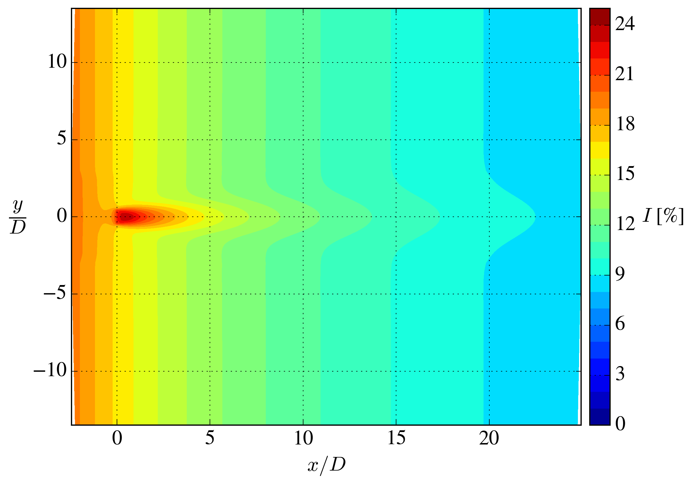

# single_turbine_uniform_inflow

A single AD case with uniform inflow. The case is similar to the 20\% TI case from [Fei et al. (2025)](https://iopscience.iop.org/article/10.1088/1742-6596/3016/1/012033).

Takes around 25 seconds to simulate on my laptop (Apple M4 Pro). 

## Grid

- Rotor diameter: $D = 40$ m.
- Domain size: $L_x/D = L_y/D = L_z/D = 27.5$.
- Background resolution: $\frac{D}{\Delta x} = \frac{D}{\Delta y} = \frac{D}{\Delta z} = 2$.
- Resolution in refined region: $\frac{D}{\Delta x} = \frac{D}{\Delta y} = \frac{D}{\Delta z} = 8$
- Total number of cells: 296k.

## Inflow

At the inlet, the following values are set:

- Velocity: $U = 10$ m/s.
- TKE: $k = 6.0~\textrm{m}^2~\textrm{s}^{-2}$.
- Dissipation: $\varepsilon = 0.243~\textrm{m}^2~\textrm{s}^{-3}$.

The turbulence will decay throughout the domain, because there is no shear and therefore to turbulence production. 

## Results

## Comparison with reference data

We here compare with data from [Fei et al. (2025)](https://iopscience.iop.org/article/10.1088/1742-6596/3016/1/012033).

There is some disagreement, which are likely because of the resolution used.

