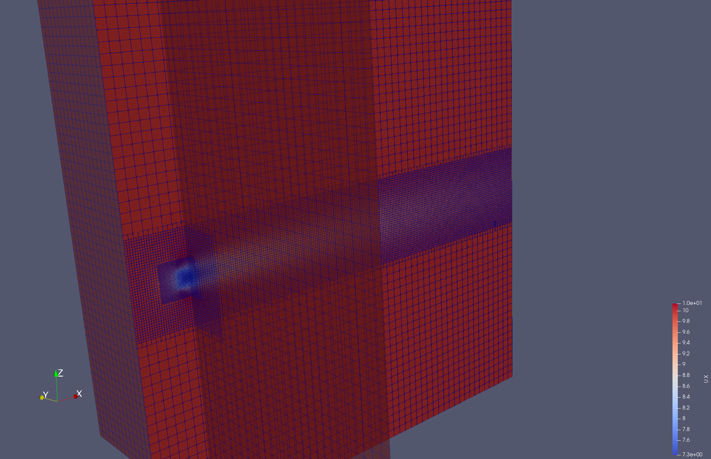
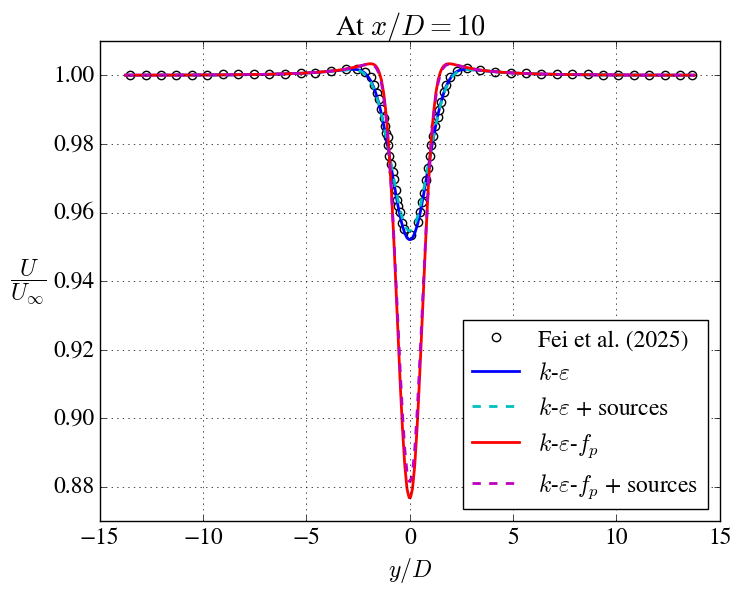
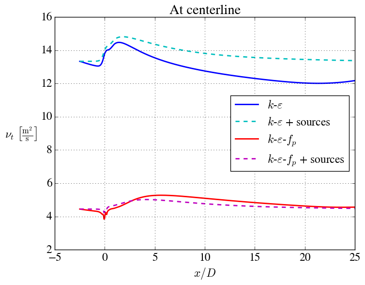

# single_turbine_uniform_inflow

A single AD case with uniform inflow. The case is similar to the 20\% TI case from [Fei et al. (2025)](https://iopscience.iop.org/article/10.1088/1742-6596/3016/1/012033). In addition, cases with turbulence source terms (to prevent turbulence decay) and with the $`f_p`$ limiter are included.

Takes around 55 seconds to simulate on my laptop (Apple M4 Pro). 

## Grid

- Rotor diameter: $D = 40$ m.
- Domain size: $L_x/D = L_y/D = L_z/D = 27.5$.
- Background resolution: $\frac{D}{\Delta x} = \frac{D}{\Delta y} = \frac{D}{\Delta z} = 2$.
- Resolution in first refined region: $\frac{D}{\Delta x} = \frac{D}{\Delta y} = \frac{D}{\Delta z} = 8$
- Resolution in second refined region: $\frac{D}{\Delta x} = \frac{D}{\Delta y} = \frac{D}{\Delta z} = 16$
- Total number of cells: 550k.

## Inflow

At the inlet, the following values are set:

- Velocity: $U = 10$ m/s.
- TKE: $k = 6.0~\textrm{m}^2~\textrm{s}^{-2}$.
- Dissipation: $\varepsilon = 0.243~\textrm{m}^2~\textrm{s}^{-3}$.

The turbulence will decay throughout the domain, because there is no shear and therefore to turbulence production. This can be prevented by adding source terms to the turbulence equations.

For uniform inflow $f_p = f_0$ in the undisturbed flow, hence

$$
\nu_t = C_\mu f_0 \frac{k^2}{\varepsilon}
$$

in the $`k`$-$`\varepsilon`$-$`f_p`$ model. This is unlike in log-law inflow, where $f_p = 1$ in the undisturbed flow. To compensate for this, we multiply the inflow $`\varepsilon`$ with $f_0$.

## Contours

- Turbulence decays throughout the domain, because the TKE production is zero for uniform inflow. This can be prevented by adding source terms to the turbulence equations.
- The $`f_p`$ limiter gives a slower wake recovery, which is more alike typical LES results.

## Comparison with reference data

We here compare with data from [Fei et al. (2025)](https://iopscience.iop.org/article/10.1088/1742-6596/3016/1/012033), who used a plain $`k`$-$`\varepsilon`$ model.

