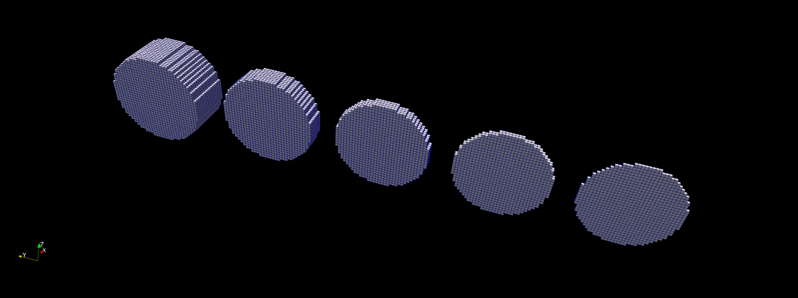
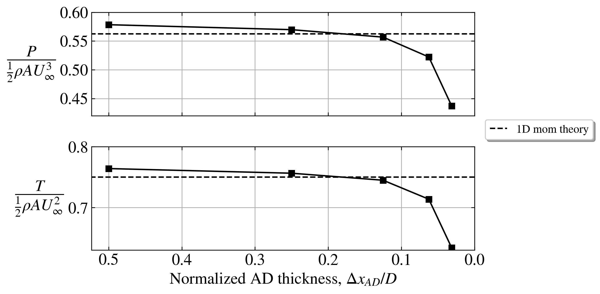
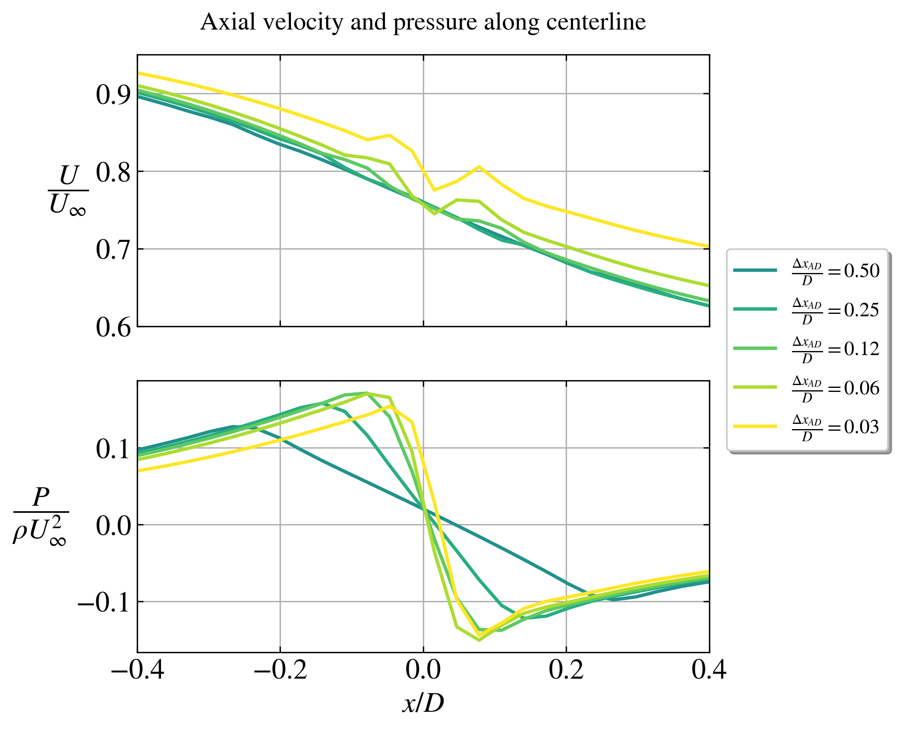
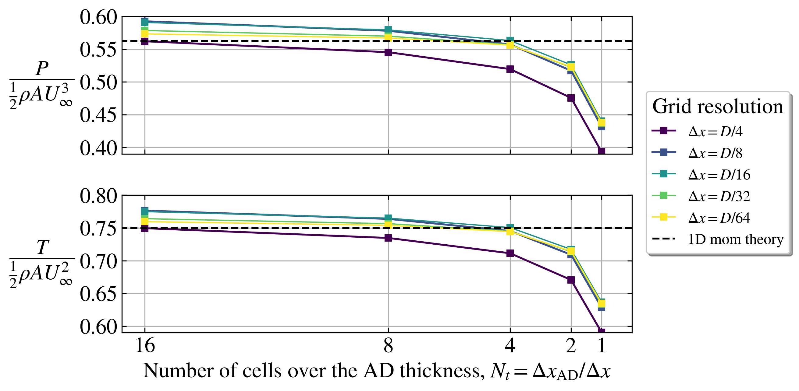

# AD thickness study

Single AD with 3D Euler equations. Uniform and laminar inflow.

Study of the AD thickness.

## Parameters

- Rotor diameter: $D = 80$ m.
- Thrust coefficient based on disk velocity: $C_T' = \frac{4}{3}$ (corresponds to $C_T = 0.75$ via 1D mom theory)
- Disk center location: At (0,0,0)
- Domain size: $L_x/D = L_y/D = L_z/D = 16$.
- Blockage ratio: $\pi R^2/(L_y L_z) = 0.3$ %.
- Cell size in background grid: $\frac{D}{\Delta x} = 4$.
- Refinement region: $x/D = [-3,4]$, $y/D = [-1,1]$, $z/D = [-1,1]$.
- Cell size in refinement region: depends on the study.

## AD thickness

Usually, an AD thickness ($\Delta x_{AD}$) of two cells is used (better numerical stability than just one cell) in `actuatorDiskFoam`, e.g. for $\Delta x = \frac{D}{32}$, the AD thickness would be $\Delta x_{AD} = 2 \Delta x = \frac{D}{16}$, but one is free to choose any number of cells.

It is found that the AD thickness has a large influence on the results.

## Results (fixed $D/\Delta x = 32$, varying $\Delta x_{AD}$)

In this initial study, we keep the background grid resolution fixed and vary the number of cells per AD thickness: $\Delta x_{AD} / \Delta x = \{16,8,4,2,1\}$ (corresponding to $\Delta x_{AD} = \{\frac{D}{2},\frac{D}{4},\frac{D}{8},\frac{D}{16},\frac{D}{32}\}$).

- The power and thrust begin to deviate significantly from 1D mom'm theory, when the AD becomes thin (say smaller than 10% of the AD diameter).
- Some artificial wiggles in $U(x)$ are present for a thin AD.

[comment]: <> (Small technical detail: The thinnest AD only has one cell, which means that its center is actual not exactly at x=0, but at x=Deltax/2. All the other ADs have equal number of cells on left and right of x=0, hence their center is exactly at x=0. This can be seen in the pressure plot.)

## Smearing parameter: $\Delta x_{AD}/\Delta x$

It turns out that it is the number of cells per AD thickness, $\Delta x_{AD}/\Delta x$, which is the important parameter (and not the actual thickness, $\Delta x_{AD}$). This is analoge to the dependence on $\varepsilon/\Delta x$ in Gaussian smearing AD/ALs. 

- The above plot shows that, irrespective of the background grid resolution, there is a similar behaviour, namely that power and thrust decrease with decreasing $N_t$.
- $N_t$ is as important (if not more) as the grid resolution.
- The best agreement with 1D momentum theory is for $N_t = 4$.

